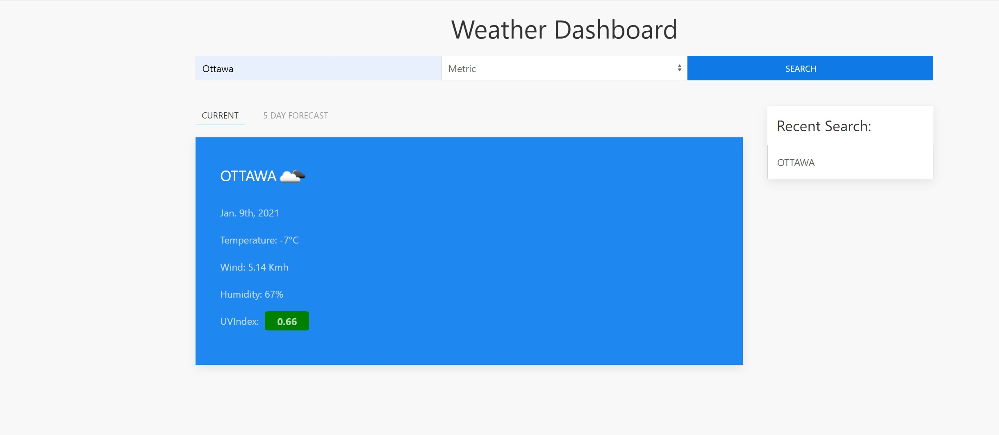
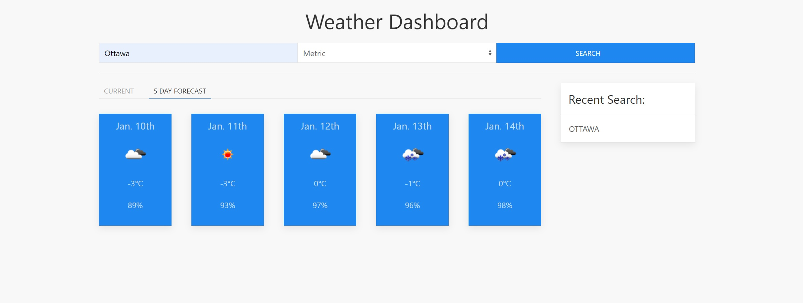
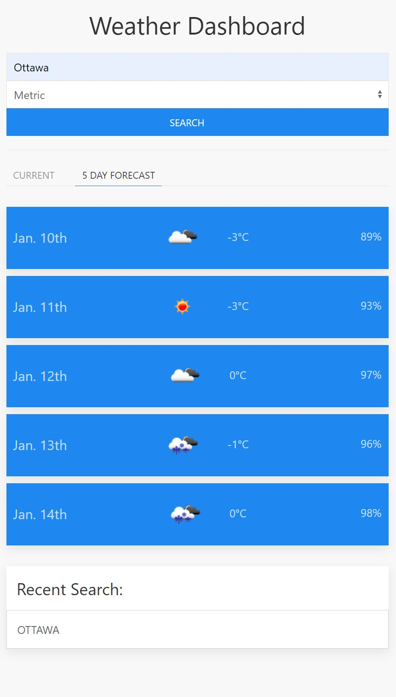

# weather-dashboard

check the weather in your city or another city of you choice just type the name of the city in the search bar and choose the units value to your liking and search.
a succesful search will present:

* current weather information
* 5 day weather conidtions 
* the name of the city will be added to recnet seach list which displays a users last 5 recent searches

Current weather diplays the following:
* city name and current forecast
* todays date
* current temperture
* wind speed
* humidity
* UVIndex (click on uvindex value to see the uvindex legned)

5day weather displays:
* the date
* forecast
* highest temperture during that day
* humidity 

technologies used in the app are: 
* Html
* CSS ( UIkit framework was used for learning purposes)
* javascript

Visit [Weather Dashboard](https://laithalwani.github.io/weather-dashboard/)

please contact me at laithalwani@gmail.com for further informations.

